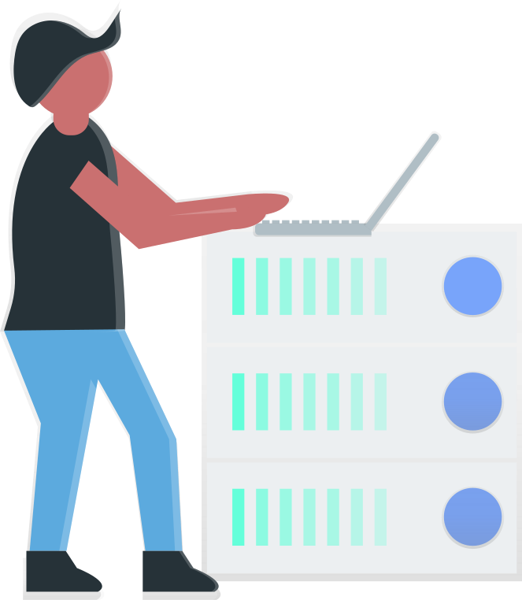

> [@Crusher Invite Link](https://discord.com/api/oauth2/authorize?client_id=856581397690187778&permissions=8&scope=bot)

# Intuitive

**Get started in seconds.**

Crusher is the quickest way to turn your Discord server into the big stage. Whether you're an upcoming artist, a super star, or a hobby DJ: Sharing music through Discord has never been easier.

# Social

**Listen to music with your friends.**

What better way is there to enjoy hanging out with friends than music?! With Crusher, you can turn your Discord server into a listening party everyone can contribute to.

# 24/7 Support

**Enjoy instant support.**

Something not right? Don't worry, we've got you covered. Our support team is always available directly on Discord, or alternatively via email. No automated responses or complicated help desks.

# Stable

**Never miss a beat.**

Behind the scenes we're working around the clock to make sure you can seamlessly enjoy your music experience. Groovy runs on state-of-the-art tech to ensure minimal downtime, low latency, and no disruptions.

